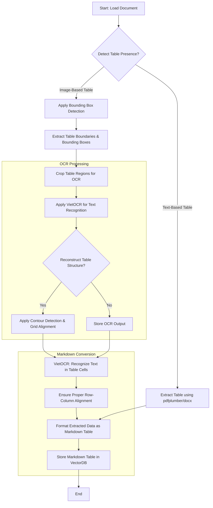
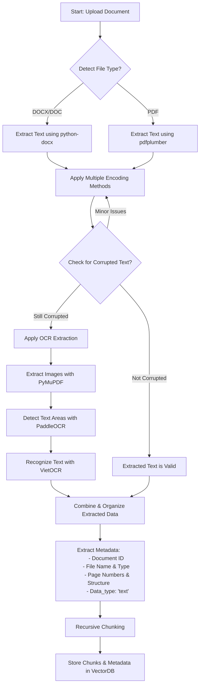
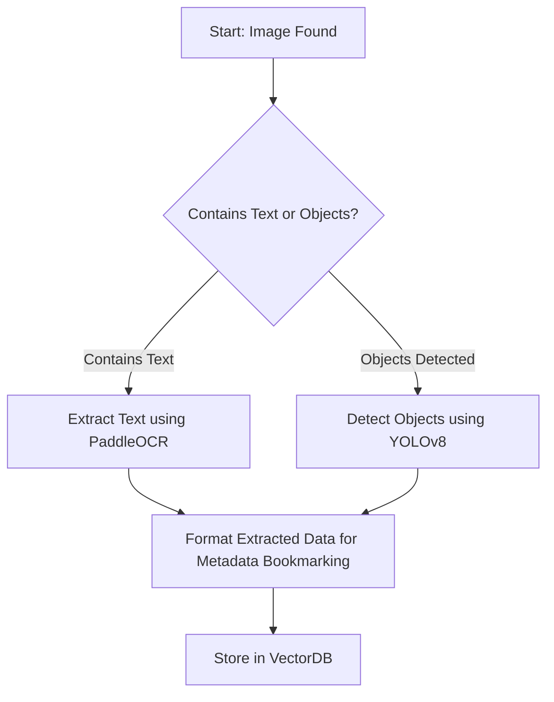

# Table-type preprocessing

```mermaid

graph TD;

  

A[Start: Load Document] --> B{Detect Table Presence?};

  

B -->|Text-Based Table| C[Extract Table using pdfplumber/docx];

B -->|Image-Based Table| D[Apply Bounding Box Detection];

  

D --> E[Extract Table Boundaries & Bounding Boxes];

E --> F[Crop Table Regions for OCR];

  

subgraph OCR Processing

F --> G[Apply VietOCR for Text Recognition];

G --> H{Reconstruct Table Structure?};

H -->|Yes| I[Apply Contour Detection & Grid Alignment];

H -->|No| J[Store OCR Output];

end

  

I --> K[VietOCR: Recognize Text in Table Cells];

J --> K;

  

subgraph Markdown Conversion

K --> L[Ensure Proper Row-Column Alignment];

L --> M[Format Extracted Data as Markdown Table];

M --> N[Store Markdown Table in VectorDB];

end

  

C --> M;

N --> O[End];

```

  
# Text-type preprocessing

```mermaid
graph TD;

  A[Start: Upload Document] --> B{Detect File Type?};

  B -->|DOCX/DOC| C[Extract Text using python-docx];
  B -->|PDF| D[Extract Text using pdfplumber];

  C --> E[Apply Multiple Encoding Methods];
  D --> E;

  E --> E1{Check for Corrupted Text?};

  E1 -->|Minor Issues| E;
  E1 -->|Not Corrupted| G[Extracted Text is Valid];
  E1 -->|Still Corrupted| H1[Apply OCR Extraction];

  H1 --> H2["Extract Images with PyMuPDF"];
  H2 --> F["Detect Text Areas with PaddleOCR"];
  F --> G2["Recognize Text with VietOCR"];
  G2 --> K[Combine & Organize Extracted Data];

  G --> K;

  K --> M["Extract Metadata:  
          - Document ID  
          - File Name & Type  
          - Page Numbers & Structure  
          - Data_type: 'text'"];

  M --> N[Recursive Chunking];

  N --> O[Store Chunks & Metadata in VectorDB];
```
  

  
# Image-type preprocessing

```mermaid

graph TD;

A[Start: Image Found] --> B{Contains Text or Objects?};

  

B -->|Contains Text| C[Extract Text using PaddleOCR];

B -->|Objects Detected| D[Detect Objects using YOLOv8];

  

C --> E[Format Extracted Data for Metadata Bookmarking];

D --> E;

  

E --> G[Store in VectorDB];

```
