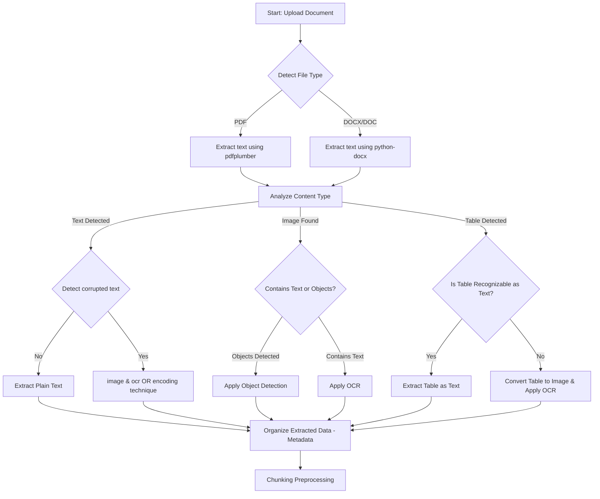
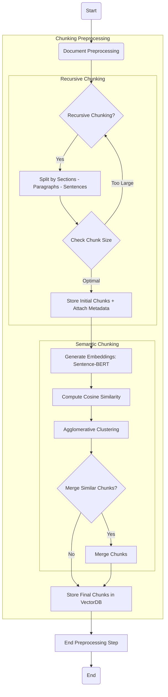

# Preprocessing

## Document Preprocessing

```mermaid
graph TD;
  A[Start: Upload Document] --> B{Detect File Type};

  B -->|DOCX/DOC| C[Extract text using python-docx];
  B -->|PDF| D[Extract text using pdfplumber];

  D --> E[Analyze Content Type];
  C --> E;

  E -->|Text Detected| F{Detect corrupted text};
  E -->|Table Detected| G{Is Table Recognizable as Text?};
  E -->|Image Found| H{Contains Text or Objects?};

  F -->|No| F1[Extract Plain Text];
  F -->|Yes| F2[image & ocr OR encoding technique];
  F1 --> L;
  F2 --> L;

  H -->|Objects Detected| H1[Apply Object Detection];
  H -->|Contains Text| H2[Apply OCR];
  H1 --> L;
  H2 --> L;

  G -->|Yes| I[Extract Table as Text];
  G -->|No| J[Convert Table to Image & Apply OCR];

  I --> L[Organize Extracted Data - Metadata];
  J --> L;

  L --> M[Chunking Preprocessing];

```

## Chunking Preprocessing

```mermaid
graph TD;
A(Start) --> C(Document Preprocessing);

subgraph Chunking Preprocessing
  C --> D{Recursive Chunking?};

  subgraph Recursive Chunking
    D -->|Yes| E[Split by Sections - Paragraphs - Sentences];
    E --> H{Check Chunk Size};
    H -->|Too Large| D;
    H -->|Optimal| I[Store Initial Chunks + Attach Metadata];
  end

  subgraph Semantic Chunking
    I --> J[Generate Embeddings: Sentence-BERT];
    J --> K[Compute Cosine Similarity];
    K --> L[Agglomerative Clustering];
    L --> M{Merge Similar Chunks?};
    M -->|Yes| N[Merge Chunks];
  end

  M -->|No| O[Store Final Chunks in VectorDB];
  N --> O;
end

O --> Q[End Preprocessing Step];
Q --> R(End);

```
