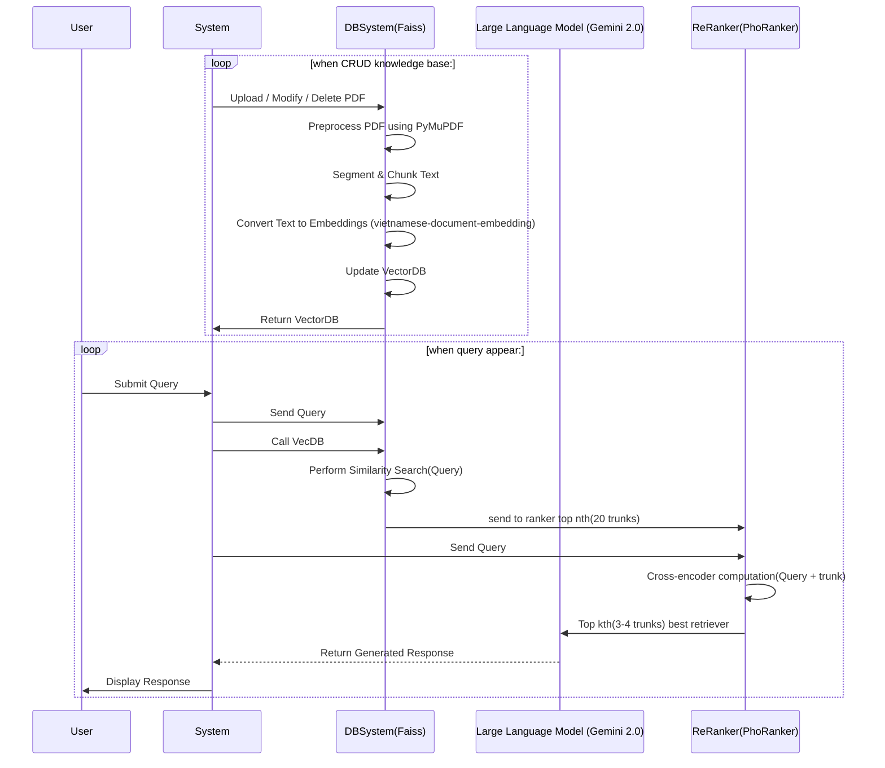

# Vietnamese SchoolChatbot

Chatbot feeded by school's information

## Problems:

-   **Use Cases**:
    -   _**Đã Xong**_: Trả lời câu hỏi và trích đoạn được câu hỏi từ tài liệu nào.
    -   _**Chắc chắn sẽ làm**_:
        -   Chatbot tích hợp vào website. (UI)
        -   History: Thread with multiple Gemini & multiple requests (xây dựng sau, cùng với web). (UI)
        -   CRUD được VectorDB: Cho các trường hợp cần thay đổi thông tin từ các tài liệu học. (preprocessing)
        -   Gợi ý các câu hỏi dựa trên các câu hỏi hiện tại (UI)
        -   Chunking method: Recursive(hierarchical) + Semantics
    -   _**Đang đắn đo**_:
        -   Chatbot có thể tự tra mạng để trả lời các truy vấn(!?)
        -   Trích file ảnh
        -   Trả lời: FAQs, courses, syllabus, prerequisite, giáo viên, học phần, faculties, schedules, tuyển sinh, Student Services, hướng nghiệp khi **học viên** hỏi (Indentification) (UI + input data đa dạng)
        -   Trả các đường link truy cập TCU liên quan đến Users' req
        -   Gọi các API để vẽ biểu đồ, flowchart trực quan (visualisation tool) (UI)
        -   Gợi ý câu hỏi dựa trên câu hỏi hiện tại
-   **Requirement**:
    -   **Non-Functional Req**:
        -   Integrity: Độ nhất quán về thông tin cao, sai sót tối thiểu (chatbot: ảnh hưởng đến tư vấn sinh viên + quân đội) -> Cần test chatbot kĩ lưỡng + đầu vào thông tin chuẩn
        -   Response time: nhanh (ít nhất chatbot đưa ra các dòng đầu tiên trong câu trả lời trong vòng <3s) -> retrieve augmented + stream answer
        -   Smart: Có thể đáp ứng tuyển sinh, thông tin nhà trường, lịch học, tư vấn ngành học, thông tin GV, lịch học, làm các tác vụ văn thư, ...
        -   Maintainability: dễ duy trì, đáp ứng phần cứng hệ thống (chưa có thông tin)
        -   Security: (chưa có thông tin) :((
    -   **Functional Req**:
        -   Preprocessing: (Doc_info retrieving, Chunking, VectorDB)
            -   Preprocesing các dạng tài liệu khác nhau từ structured: .json, .markdown, .xml, .csv đến unstructured: .doc, .docx, .pdf, ...
            -   Preprocessing các dạng format đầu vào: image, table, txt
            -   Chunking: trích xuất được data đầy đủ và có format nhất -> về dạng markdown + semantics + hiararchy
            -   VectorDB đáp ứng được CRUD
        -   Processing: (VectorDB, WebSearch, Ranker, LLM)

